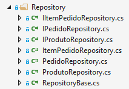

# Aula 1

- Refatoração para o Repository Pattern
- 
- Atualizaões para ASP.NET Core V.2:
  - Target Framework mudou para **.NET Core 2.0**
  - Alteração no arquivo .csproj:
    ```
    <ItemGroup>
      <PackageReference Include="Microsoft.AspNetCore.All" Version="2.0.0" />
    </ItemGroup>
    ```
   - Alteração da versão de ferramentas de linha de comando
    ```
    <ItemGroup>
      <DotNetCliToolReference Include="Microsoft.EntityFrameworkCore.Tools.DotNet" Version="2.0.0" />
      <DotNetCliToolReference Include="Microsoft.Extensions.SecretManager.Tools" Version="2.0.0" />
      <DotNetCliToolReference Include="Microsoft.VisualStudio.Web.CodeGeneration.Tools" Version="2.0.0" />
    </ItemGroup>  
    ```
